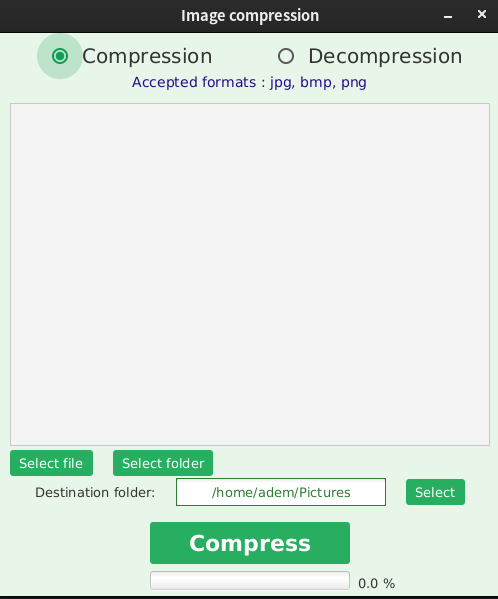

# RLE-compression
A simple Run-length encoding for images with JavaFX feamework

This is not an eficient way to compress images. This project is an exemple of how Run-length encoding can be implemented using Java. It contais a good exemple of bits
manipulation.

***Note: This project contains a legacy code that i wrote when i was still learning so it does not respect the best programing preactices.***

# Requirements
* Java >= 8
* Gradle

# Usage
It is simple just select an image then compress.

Note: for a notable results use .bmp image. Using g png or jpeg images is not recommended those type of images are already compressed and using Run-length will result in a bigger image because the image
gets decompressed before applying Run-length algorithm

# Screenshot

